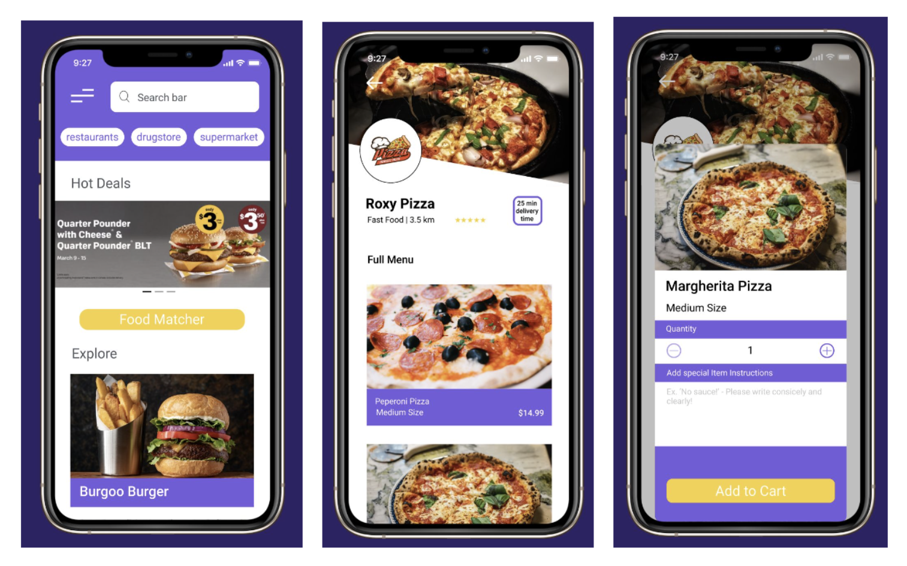
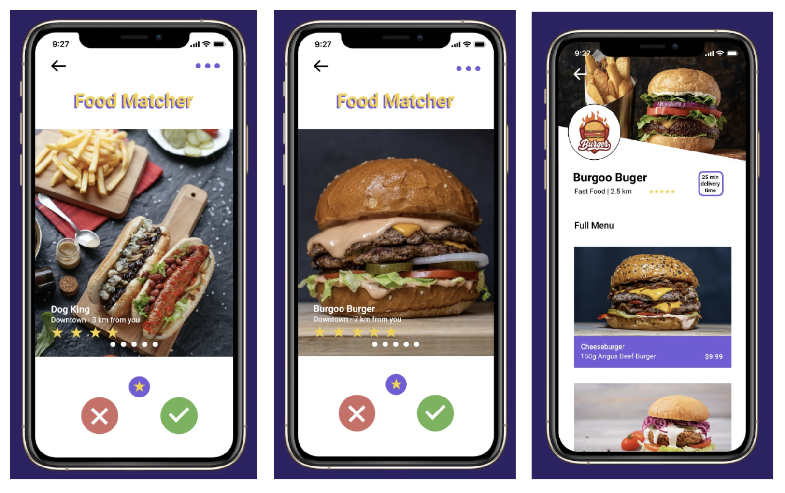
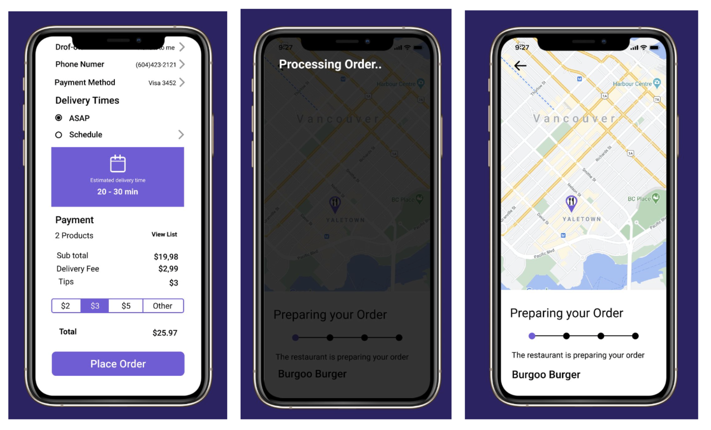

# Zippy Delivery App

Project developed during the course of UI / UX held at the BCIT institution in the Applied Web Development program. The objective of this project was to develop the UI / UX of a delivery application and bring new features to the application. The project had a study carried out throughout the semester until reaching a final product model.

Below, some screens of the final project.

